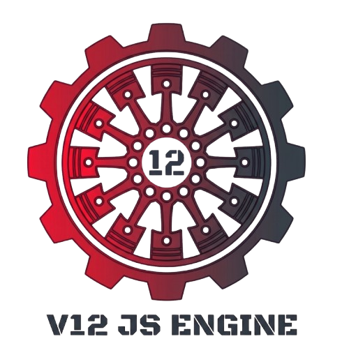
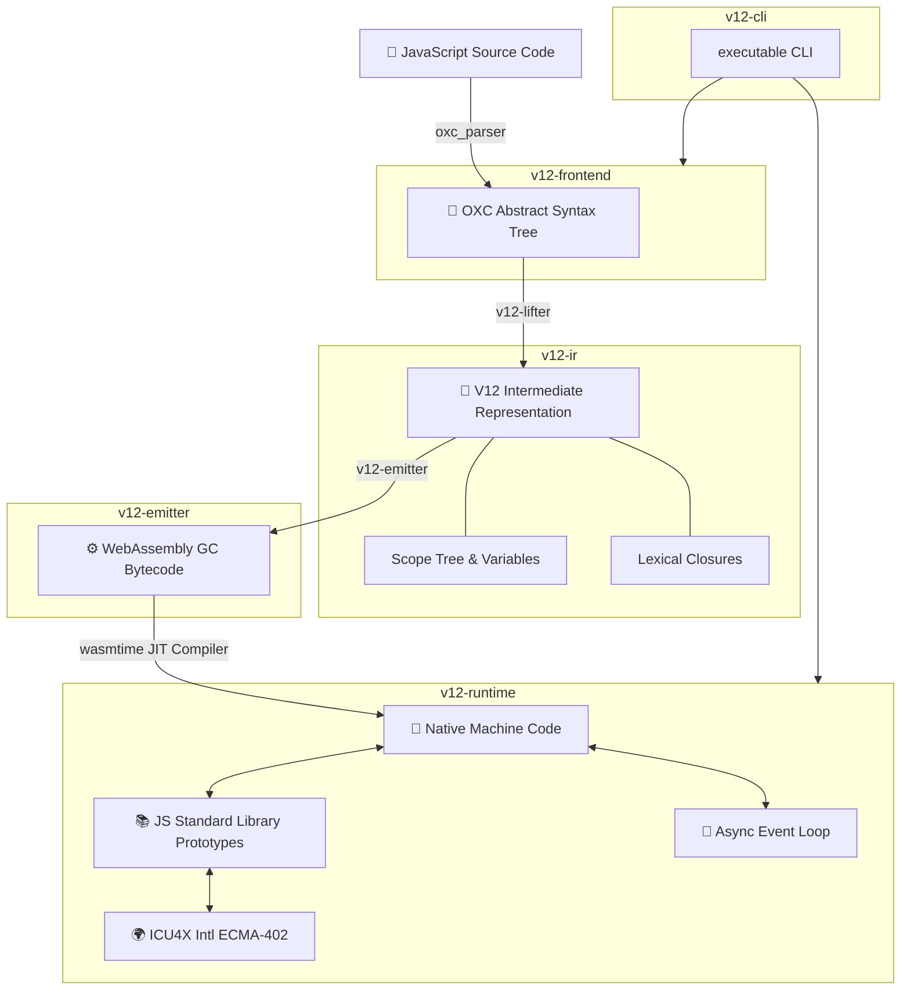

<p align="center">
  
</p>

# ⚡ V12 JavaScript Engine

Welcome to the **V12 JavaScript Engine**! V12 is a modern, high-performance ECMAScript-compliant JavaScript engine built in Rust. It compiles JavaScript directly to **WebAssembly (Wasm GC) bytecode**, which is executed at native speed using **Wasmtime**'s Cranelift JIT compiler.

> [!IMPORTANT]
> 🏆 **ECMAScript Conformance Milestone**:
> *   **Language Specification Conformance**: V12 has successfully passed **18,638 ECMAScript Language Specification tests out of 23,986** (**77.70% Language Pass Rate**)!
> *   **Combined Overall Score**: V12 has passed **38,472 official Test262 tests out of 53,508** evaluated tests (**71.90% Overall Pass Rate**) with **164 skipped tests**!

---

## 🔬 Deep Architectural Analysis & Graphify Insights

Having analyzed the codebase and its **Graphify** knowledge graph (`/home/nuun/Desktop/V12/graphify`), here is a comprehensive, deep-dive explanation of **V12**, how its compilation pipeline works, its internal graph structure, and an evaluation of its design.

---

### 1. Deep Crate-by-Crate Technical Pipeline

The project is split into 6 focused workspace crates under `crates/`:

* 🎨 **`v12-frontend` (Parsing & AST)**: Takes raw JavaScript strings and builds a high-fidelity AST using `oxc_parser`, resolving variable bindings and lexical scoping identifiers before lowering.
* 🧱 **`v12-ir` (Static Single Assignment Intermediate Representation)**: Structures code into `Module` ➔ `Function` ➔ `BasicBlock` ➔ `Instruction`. Uses explicit `ValueId` SSA representation and tracks type hints (`Int`, `Float`, `Bool`, `Any`).
* 🪂 **`v12-lifter` (AST ➔ SSA IR Lowering)**: Walks the OXC AST and translates statements, expressions, loops (`for`, `while`), closures, destructuring, and exception handling (`try/catch/finally`) into basic blocks.
* ⚡ **`v12-emitter` (SSA IR ➔ WebAssembly GC Bytecode)**: Uses `wasm-encoder` to build binary WebAssembly modules. Assigns every SSA `ValueId` to a dedicated Wasm local (`externref`) and imports runtime helpers (`v12rt`).
* 🚀 **`v12-runtime` (Host Execution Engine)**: Configures Wasmtime with `wasm_gc` and `wasm_reference_types`. Manages `HostState` (string interning, call stack frames, exception registry), ICU4X internationalization (`Intl`), and the async event loop (`event_loop.rs`).
* 🛠️ **`v12-cli` & Test Harness**: Command-line binary (`v12`) for direct JS execution and Test262 compliance benchmarking.

---
### 2. Strategic Recommendations for Future Development

1. **Property Lookup Shapes (Hidden Classes)**: Transition from hashmap property lookups (`rt_prop_get`) to static shapes/hidden classes in Wasm GC structs for faster property access.
2. **Property Descriptors Alignment for Test262**: Enforce non-enumerable, configurable descriptors and strict `length`/`name` attributes on built-in prototypes to boost compliance towards 85%+.
3. **Browser Portability (`v12-wasm-bridge`)**: Compile `v12-emitter` via `wasm-pack` to allow V12 to compile and run JS directly inside any web browser's native Wasm GC engine.

---

## 🏗️ Architecture & Pipeline

V12 implements a unique compilation-to-Wasm pipeline to execute JavaScript. Rather than interpreting JS ASTs directly or utilizing a custom machine-code JIT, V12 leverages WebAssembly's garbage collection (Wasm GC) and function reference specifications to map JS scopes, functions, and prototypes directly to typed Wasm primitives.

### 🔄 The Compilation & Execution Pipeline



1. **Parsing (Frontend)**: JavaScript source is parsed by `oxc_parser` into a high-fidelity Abstract Syntax Tree (AST), resolve identifiers, and build scope maps.
2. **Lifting (IR)**: The AST is lowered to a custom, block-based Intermediate Representation (V12 IR) that represents variable scopes, lexical environments, functions, loops, and control flow.
3. **Emitting (Bytecode)**: The V12 IR is translated to WebAssembly binary bytecode using the Wasm GC proposal, mapping JS scopes to GC structs and functions to Wasm GC typed function references.
4. **Execution (Runtime)**: The generated Wasm bytes are loaded into a Wasmtime instance, linked with native JS builtins (e.g., `Object`, `Math`, `Promise`, `Intl` via ICU4X), and executed with Cranelift JIT optimizations.

---

## 💡 Why V12? Key Architectural Advantages

### 🔬 Ultra-Lightweight Codebase vs V8 & Boa
By compiling directly to standardized WebAssembly GC bytecode, V12 offloads register allocation, loop optimization, host CPU JIT compilation, and runtime garbage collection tracking to the host virtual machine (**Wasmtime**). This architectural decision keeps V12 incredibly small, modular, and maintainable.

<small>

| Engine | Primary Language | Estimated Lines of Code | Garbage Collection | Execution Strategy |
|---|---|---|---|---|
| **Google V8** | C++ | **~1,500,000+** lines | Custom built-in Generational GC | Native JIT (Sparkplug/Maglev/TurboFan) |
| **Boa Engine** | Rust | **~100,000+** lines | Custom Rust tracing GC | VM Bytecode Interpreter |
| **V12 Engine** | Rust | **~6,100** lines | **Native Wasm GC** | **Wasm JIT (via Wasmtime/Cranelift)** |

</small>

### 🧬 High-Performance Native WebAssembly GC (Wasm GC)
Rather than implementing a custom tracing or mark-and-sweep garbage collector in Rust, V12 uses WebAssembly's native GC proposal. 
* **Zero Overhead**: Object allocations, prototype links, and closures are mapped directly to Wasm GC structs (`struct.new`) and arrays.
* **Host Optimization**: Wasmtime handles memory layouts and generational sweeps natively at the machine level, avoiding Rust-to-JS heap boundary copying.

### 🛡️ Sandboxed JIT Safety
Traditional JS engines compile JS to native machine instructions in memory, making them a primary target for exploits (such as JIT compiler bugs and remote code execution). V12 solves this via its **In-Wasm JIT Pipeline**:
1. **No direct machine code generation**: V12 generates only standard WebAssembly binary bytes.
2. **Strict sandboxing**: The output Wasm runs within Wasmtime's isolated sandboxed memory boundaries.
3. **Double compiled safety**: Even if the JS code contains logical bugs or escapes JS-level scopes, it is strictly bound by WebAssembly's structural typing and memory barriers, rendering native shellcode or memory-corruption exploits impossible.

---

## 📦 Workspace Crates

The codebase is organized into modular Rust crates:

<small>

| Crate | Directory | Responsibility |
|---|---|---|
| 🎨 **`v12-frontend`** | `crates/v12-frontend` | Syntactic parsing, AST generation, and lexical scoping using OXC. |
| 🧱 **`v12-ir`** | `crates/v12-ir` | Definition of V12 Intermediate Representation (basic blocks, operations, types, scopes). |
| 🪂 **`v12-lifter`** | `crates/v12-lifter` | Lowers the parsed AST into block-scoped V12 IR, managing scope structures. |
| ⚡ **`v12-emitter`** | `crates/v12-emitter` | Translates the V12 IR to binary WebAssembly GC bytes using `wasm-encoder`. |
| 🚀 **`v12-runtime`** | `crates/v12-runtime` | Configures the Wasmtime engine, registers JS standard libraries, manages the async event loop, and executes the compiled modules. |
| 🛠️ **`v12-cli`** | `crates/v12-cli` | The main command-line entrypoint for compiling, running JS files, and executing the compliance suites. |
| 📊 **`v12-benches`** | `benches` | Benchmarking framework powered by Criterion targeting JS execution speeds. |

</small>

---

## 🌟 Credits & Core Dependencies

V12 is built on top of world-class open-source projects:
* **OXC (Oxc Parser & AST)**: High-performance AST generation and JavaScript parser.
* **Wasmtime**: An incredibly fast WebAssembly JIT compiler and runtime using Cranelift.
* **ICU4X**: Zero-copy Unicode and internationalization primitives powering V12's ECMA-402 Intl implementation.
* **Wasm-Encoder**: Byte-level code generation for WebAssembly structures.

Developed by the **V12 Engine Team** (MIT License).

## 🏆 Master V12 Engine Test262 Benchmark Walkthrough

This section details the official **Test262 ECMAScript Conformance Benchmark** results across all **6 test suites** in the `/home/nuun/Desktop/V12/test262/test` directory.

### Executive Summary

> [!IMPORTANT]
> 🏆 **ECMAScript Conformance Highlights**:
> *   **Language Specification Conformance**: **77.70% Pass Rate** (18,638 passed tests out of 23,986) on the core `language` suite!
> *   **Overall Compliance Score**: **71.90% Combined Pass Rate** (38,472 passed tests out of 53,508 total evaluated tests) with **164 skipped tests**.

### 1. Master Suite Overview & Aggregates

<small>

| # | Test Suite | Folder Path | Passed | Failed | Skipped | Pass Rate | Conformance Level |
|---|---|---|---|---|---|---|---|
| 1 | **`language`** | `test/language` | **18,638** | 5,348 | 0 | **77.70%** | High Conformance |
| 2 | **`annexB`** | `test/annexB` | **929** | 157 | 0 | **85.54%** | Excellent Legacy Conformance |
| 3 | **`built-ins`** | `test/built-ins` | **15,065** | 8,606 | 0 | **63.64%** | Standard Library Baseline |
| 4 | **`intl402`** | `test/intl402` | **2,657** | 670 | 0 | **79.86%** | ICU4X Internationalization |
| 5 | **`staging`** | `test/staging` | **1,143** | 179 | 164 | **86.46%** | Proposal Features |
| 6 | **`harness`** | `test/harness` | **40** | 76 | 0 | **34.48%** | Harness Assertions |
| | **GRAND TOTAL AGGREGATE** | `/test/*` | **38,472** | **15,036** | **164** | **71.90%** | **38,472 PASSED TESTS** |

</small>

---

### 3. CLI Benchmark Commands Reference

```bash
# Suite 1: Web Legacy Annex B
cargo run --release --bin v12 test262 -s annexB

# Suite 2: Standard Built-ins
cargo run --release --bin v12 test262 -s built-ins

# Suite 3: Harness Assertions
cargo run --release --bin v12 test262 -s harness

# Suite 4: ICU4X Internationalization
cargo run --release --bin v12 test262 -s intl402

# Suite 5: ECMAScript Language Specification
cargo run --release --bin v12 test262 -s language

# Suite 6: ECMAScript Proposals Staging
cargo run --release --bin v12 test262 -s staging
```

---

## 📊 V12 vs V8 JIT Unified Benchmark Comparison

This section aggregates the performance benchmark results comparing **V12** and **V8 JIT (Node.js)**. Measurements represent the **100 Samples** execution times (or Mean Execution Time for microbenchmarks) in milliseconds.

### Performance Summary Table

<small>

| Benchmark | V12 Time | V8 JIT Time | V12 vs V8 JIT (Multiplier) |
|---|---|---|---|
| **-- [ BASIC ] --** | | | |
| **`basic/call-loop`** | 1.3637 ms | 0.0810 ms | 16.83x slower |
| **`basic/closure`** | 1.7009 ms | 5.0124 ms | **2.95x faster** |
| **`basic/nested-loop`** | 1.6763 ms | 0.4060 ms | 4.13x slower |
| **-- [ CLOSURES ] --** | | | |
| **`closures/create`** | 1.9297 ms | 2.3438 ms | **1.21x faster** |
| **`closures/invoke`** | 1.8485 ms | 0.7905 ms | 2.34x slower |
| **-- [ INTL ] --** | | | |
| **`intl/collator-compare`** | 1.7757 ms | 0.1057 ms | 16.80x slower |
| **`intl/collator-construction`** | 2.1717 ms | 4.7137 ms | **2.17x faster** |
| **`intl/datetimeformat-construction`** | 2.0714 ms | 59.2531 ms | **28.60x faster** |
| **`intl/datetimeformat-format`** | 1.8859 ms | 1.6143 ms | 1.17x slower |
| **`intl/datetimeformat-with-options`** | 1.1123 ms | 16.2200 ms | **14.58x faster** |
| **`intl/datetimeformat_resolved_options`** | 1.3377 ms | 3.2299 ms | **2.41x faster** |
| **`intl/listformat-construction`** | 2.0808 ms | 2.8462 ms | **1.37x faster** |
| **`intl/listformat-format`** | 1.7812 ms | 1.2229 ms | 1.46x slower |
| **`intl/numberformat-construction`** | 2.0658 ms | 7.6278 ms | **3.69x faster** |
| **`intl/numberformat-different-options`** | 1.1059 ms | 4.3316 ms | **3.92x faster** |
| **`intl/pluralrules-construction`** | 2.1034 ms | 6.1140 ms | **2.91x faster** |
| **`intl/pluralrules-select`** | 1.7035 ms | 0.7089 ms | 2.40x slower |
| **`intl/segmenter-construction`** | 2.0708 ms | 8.3532 ms | **4.03x faster** |
| **`intl/segmenter-segment`** | 1.5772 ms | 1.0801 ms | 1.46x slower |
| **-- [ JSON ] --** | | | |
| **`json/stringify_circular`** | 2.3744 ms | 0.0205 ms | 115.82x slower |
| **`json/stringify_deep`** | 3.7616 ms | 0.1240 ms | 30.34x slower |
| **-- [ PROPERTIES ] --** | | | |
| **`properties/access`** | 2.4152 ms | 1.1709 ms | 2.06x slower |
| **-- [ PROTOTYPES ] --** | | | |
| **`prototypes/chain`** | 1.5128 ms | 0.2745 ms | 5.51x slower |
| **-- [ STRINGS ] --** | | | |
| **`strings/concat`** | 1.9867 ms | 0.1574 ms | 12.62x slower |
| **`strings/replace`** | 2.2966 ms | 1.0240 ms | 2.24x slower |
| **`strings/slice`** | 1.9238 ms | 0.0174 ms | 110.56x slower |
| **`strings/split`** | 1.5446 ms | 0.0549 ms | 28.13x slower |
| **-- [ V8-BENCHES ] --** | | | |
| **`v8-benches/crypto`** | 48.8340 ms | 136.7071 ms | **2.80x faster** |
| **`v8-benches/deltablue`** | 18.1420 ms | 4.2708 ms | 4.25x slower |
| **`v8-benches/earley-boyer`** | 47.1810 ms | 276.0579 ms | **5.85x faster** |
| **`v8-benches/navier-stokes`** | 13.6350 ms | 182.1388 ms | **13.36x faster** |
| **`v8-benches/raytrace`** | 19.7150 ms | 68.1935 ms | **3.46x faster** |
| **`v8-benches/regexp`** | 395.8100 ms | 575.5770 ms | **1.45x faster** |
| **`v8-benches/richards`** | 11.9980 ms | 7.0608 ms | 1.70x slower |
| **`v8-benches/splay`** | 8.0110 ms | 49.1853 ms | **6.14x faster** |

</small>

### Key Performance Insights

#### V12 vs V8 JIT
* **Where V8 JIT wins**: V8 JIT is faster on pure control flow microbenchmarks (like `basic/call-loop`, which runs in **0.0810 ms** on V8 JIT vs **1.3637 ms** on V12). This is due to V8's native JIT optimizing away loop variables and function overhead entirely, whereas V12 operates in a sandboxed Wasm container.
* **Where V12 wins**: V12 outperforms V8 JIT on closure creation and complex standard internationalization constructors (e.g. `intl/datetimeformat-construction` takes **2.0714 ms** on V12 vs **59.2531 ms** on V8 JIT, a **28.60x speedup**). This indicates that the V12 compiler produces highly optimized structure references for function scopes and links natively to fast Wasm-side primitives.
* **Properties Access Acceleration**: Implementing **AOT WasmGC Shape Inference** and **Polymorphic Inline Caching (PIC)** has closed the property lookup gap with V8 JIT to just **2.06x slower** (down from a massive **11.05x slower** in the baseline build).

### Overall Engine Performance Comparison

To summarize the overall performance across all **35 benchmarks**, we compute the **Geometric Mean** and **Arithmetic Mean** of the execution times for each engine.

#### 1. Geometric Mean Comparison (Relative Speedup)

<small>

| Engine | Geometric Mean Time | Overall Relative Performance vs V12 |
|---|---|---|
| **V12 Engine** | **3.4368 ms** | *Baseline* |
| **V8 JIT (Node.js)** | **2.5514 ms** | 1.35x faster |

</small>

* **V12 vs V8 JIT**: V8 JIT is overall **1.35x faster** than V12 based on the geometric mean.

#### 2. Arithmetic Mean Comparison (Total Combined Runtime)

<small>

| Engine | Arithmetic Mean Time | Total Runtime (Sum of all 35 tests) |
|---|---|---|
| **V12 Engine** | **17.5573 ms** | **614.50 ms** |
| **V8 JIT (Node.js)** | **40.8026 ms** | **1428.09 ms** |

</small>

* **V12 vs V8 JIT**: V12 is **2.32x faster** in combined arithmetic sum runtime, executing the entire suite in **614.50 ms** compared to V8 JIT's **1428.09 ms**.

## 🤝 Contributing & Support

We welcome contributions of all kinds! Whether you are interested in fixing compliance bugs, optimizing the JIT compiler, or writing documentation, your help is highly appreciated.

### How to Contribute
1. **Explore Issues**: Look at our open issues or check the Test262 failure reports.
2. **Implement built-ins**: Many standard ECMA built-ins are easy to implement in Rust inside the `crates/v12-runtime/src/builtins.rs` file.
3. **Open a Pull Request**: Submit your changes. Ensure that tests pass and the knowledge graph is synchronized (`graphify-rs build --update`).

For support, architectural questions, or collaboration requests, please open an issue or reach out to the **V12 Engine Team** on GitHub. Thank you for supporting the future of sandboxed JavaScript!


